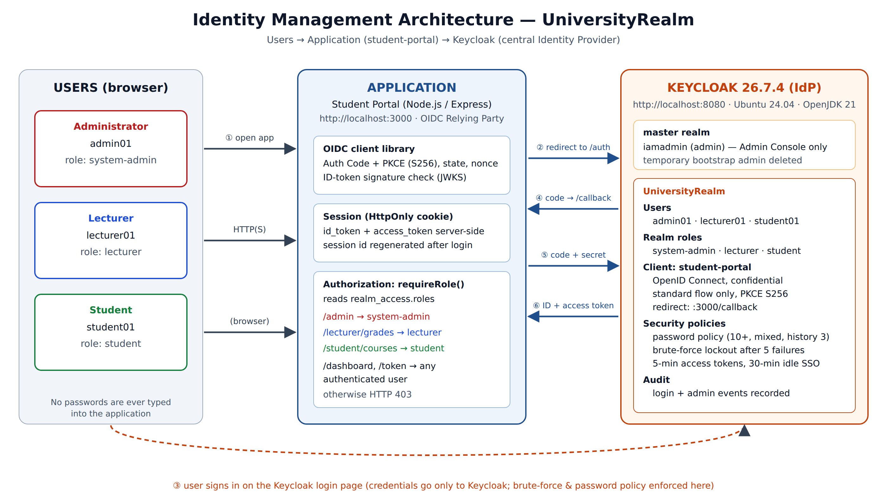
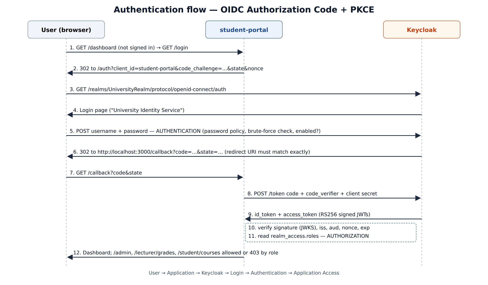

# Design Document — Centralised IAM for the University using Keycloak

| | |
|---|---|
| **Course unit** | Information Security Management — Practical take-home (40 marks) |
| **Tool** | Keycloak 26.7.4 (Quarkus distribution) |
| **Role played** | IAM Administrator |
| **Status** | Implemented and verified (see `evidence/screenshots`) |

---

## 1. Problem statement

The institution has three kinds of people: **administrators, lecturers and students**. Today each application keeps its own
accounts. That means duplicated passwords, no single place to switch someone off when they leave, and no consistent
answer to "who can do what". The institution wants **one Identity Provider (IdP)** that every application trusts for:

* **Identity** — one account per person, with username, email, first/last name and a password under policy.
* **Authentication** — proving who the person is (done only by Keycloak).
* **Authorization** — deciding what the authenticated person may do (roles issued by Keycloak, enforced by the app).

## 2. Goals and non-goals

**Goals (mapped to the marking scheme)**

| # | Goal | Assessment task |
|---|------|-----------------|
| G1 | Keycloak installed, running, reachable Admin Console, a named permanent admin account | Task 1 (5) |
| G2 | Dedicated realm `UniversityRealm` with `admin01`, `lecturer01`, `student01` and full attributes; enable/disable demo | Task 2 (8) |
| G3 | RBAC with `system-admin`, `lecturer`, `student`, least privilege, provable difference in access | Task 3 (8) |
| G4 | OIDC client `student-portal`, strict redirect URIs, working end-to-end login into a real app | Task 4 (13) |
| G5 | Architecture diagram, two risks with mitigations, two recommendations | Task 5 (6) |
| G6 | Reproducible: anyone can rebuild the lab from the repo with 3 commands | quality |

**Non-goals:** production HA/clustered deployment, external database and TLS certificates. These are covered as
*recommendations* (§9). The production Active Directory is also out of scope. §7a instead demonstrates LDAP user
federation against a local OpenLDAP directory, which uses the same Keycloak mechanism.

## 3. Environment

| Item | Value |
|------|-------|
| OS | Ubuntu 24.04.4 LTS (x86_64, kernel 6.18), 4 vCPU, 15 GiB RAM (lab VM/container) |
| Java | OpenJDK 21.0.10 |
| Keycloak | 26.7.4, `kc.sh start-dev` (dev profile, embedded H2 DB, HTTP on :8080) |
| Demo application | Node.js 22 + Express 4 + `openid-client` 5 on :3000 |
| Automation | `kcadm.sh` (Keycloak admin CLI), Playwright for evidence screenshots |

Dev mode is used on purpose for a lab. It turns off hostname/TLS strictness and uses an in-memory-style H2 database.
Section 9 lists what changes for production.

## 4. Architecture



**Components**

1. **Users (browser):** they never give a password to the application, only to the Keycloak login page.
2. **Student Portal (Relying Party):** a confidential OIDC client. It holds a client secret server-side, starts
   the login, swaps the authorization code for tokens, checks the ID token, and **enforces authorization** per route.
3. **Keycloak (OpenID Provider):**
   * `master` realm: used only to administer Keycloak (`iamadmin`). The temporary bootstrap admin is deleted.
   * `UniversityRealm`: the institution's users, roles, the `student-portal` client and security policies.
     Keeping it separate from `master` means realm users can never reach the Keycloak admin console.

### 4.1 Authentication sequence



Choice of flow: **Authorization Code + PKCE (S256)** with a confidential client.
* The implicit flow and direct-access (password) grants are **disabled**. Tokens never appear in the browser URL, and
  the app never sees a password.
* PKCE together with `state` and `nonce` protects against code interception, CSRF and token replay.
* Exact-match redirect URI `http://localhost:3000/callback`, so no wildcards and no open-redirect.

## 5. Identity model (Task 2)

| Username | First | Last | Email | Role | Enabled |
|----------|-------|------|-------|------|---------|
| admin01 | Alice | Admin | admin01@university.local | system-admin | yes |
| lecturer01 | Leonard | Lecturer | lecturer01@university.local | lecturer | yes |
| student01 | Stella | Student | student01@university.local | student | yes (disabled/re-enabled in demo) |

* All emails are marked verified; *login with email* is allowed and *duplicate emails* are rejected.
* **Self-registration is disabled.** Only the IAM administrator creates identities, which matches an institution
  where identities come from HR and admissions.
* The password policy is `length(10) and upperCase(1) and lowerCase(1) and digits(1) and specialChars(1) and notUsername and passwordHistory(3)`.
* **Enable/disable:** a disabled account keeps its data, roles and audit history but cannot authenticate. Use it
  for suspensions, leave, graduation or offboarding before deletion, a suspected compromise, or unpaid fees. Keycloak
  shows *"Account is disabled, contact your administrator"*. Disabling a user also stops them from getting new tokens.

## 6. Authorization model (Task 3)

Realm roles (not client roles), so that any future institutional app can reuse them:

| Role | Intended for | Grants in student-portal |
|------|--------------|--------------------------|
| `system-admin` | IT/system administrators of the *application* | `/admin` |
| `lecturer` | teaching staff | `/lecturer/grades` |
| `student` | enrolled students | `/student/courses` |

**Least privilege, as designed:**
1. **Each user gets exactly one role.** There are no composite roles, so `system-admin` does **not** silently include
   `lecturer` or `student`. The admin was *denied* the grades page in the demo.
2. **Application admin ≠ Keycloak admin.** `admin01` has no `realm-management` client roles, so they cannot manage
   users or roles in Keycloak. Only `iamadmin` in the `master` realm can.
3. **Deny by default.** Every protected route calls `requireRole(x)`. If the role is missing, the app returns HTTP 403.
4. **The client can only do what it needs.** Only the standard flow is on. There are no service-account, implicit or
   direct-grant capabilities.
5. **Short-lived tokens.** Access tokens last 5 minutes, SSO idle time is 30 minutes and maximum session length is
   10 hours, which limits the damage if a token is stolen.

Where the token carries roles:
```json
"realm_access": { "roles": ["student", "default-roles-universityrealm", "offline_access", "uma_authorization"] }
```
The portal only looks at the three institutional roles and ignores the default roles.

## 7. Client design (Task 4)

| Setting | Value | Why |
|---------|-------|-----|
| Client ID | `student-portal` | as specified |
| Protocol | OpenID Connect | modern, JSON/JWT based, supported everywhere |
| Client authentication | ON (confidential, client secret) | server-side app can keep a secret |
| Standard flow | ON | Authorization Code |
| Implicit / Direct access / Service accounts | OFF | reduce attack surface |
| PKCE | Required, S256 | code-interception protection |
| Root / Home URL | `http://localhost:3000` / `/` | |
| Valid redirect URIs | `http://localhost:3000/callback` | exact match, no wildcard |
| Valid post-logout redirect URIs | `http://localhost:3000/` | RP-initiated logout |
| Web origins | `http://localhost:3000` | CORS limited to the app |

**Authentication vs authorization in this implementation**
* *Authentication* happens entirely in Keycloak (steps 3–6). Keycloak checks the password, account-enabled
  state and brute-force counters, then issues a signed ID token saying *who* the user is (`sub`, `preferred_username`).
* *Authorization* happens in the portal (steps 11–12). It reads `realm_access.roles` from the access token and decides
  *what* the user may open. The demo shows that `student01` is **authenticated** but **not authorized** for
  `/lecturer/grades` (HTTP 403).

## 7a. Directory integration: LDAP / AD user federation

The brief lists "LDAP/AD configuration" as example evidence. To cover it, a local **OpenLDAP** directory
(`dc=university,dc=local`, loaded by `ldap/setup-ldap.sh`) is federated into `UniversityRealm` by
`keycloak/setup-ldap-federation.sh`:

| Setting | Value | Rationale |
|---------|-------|-----------|
| Provider | `university-ldap`, vendor *Other*, `ldap://127.0.0.1:389` | AD: vendor *Active Directory*, `ldaps://…:636` |
| Edit mode | `READ_ONLY` | the directory stays the source of truth |
| Users DN / username | `ou=people,dc=university,dc=local` / `uid` | AD: `sAMAccountName` |
| Sync | import on, full sync daily, changed users hourly | leavers lose access automatically |
| Mappers | `first name` → `givenName`; **role-groups** (`role-ldap-mapper`) maps `ou=groups` → realm roles | group membership decides the role, with no manual assignment |

Directory users: `lecturer02` (group `cn=lecturer`) and `student02` (group `cn=student`). Both sign in to the
portal with their **directory** password (Keycloak binds to LDAP to check it) and receive the matching realm role.

## 8. Security controls

| Control | Where | Mitigates |
|---------|-------|-----------|
| Password policy | Realm → Authentication → Policies | weak/guessable passwords |
| Brute-force detection (5 failures → temporary lockout, max 15 min) | Realm → Security defenses | password guessing, credential stuffing |
| No self-registration | Realm → Login | rogue accounts |
| Separate `master` vs `UniversityRealm`, bootstrap admin removed | server | privilege escalation to IdP admin |
| Login + admin events recorded (30-day expiry) | Realm → Events | accountability, incident investigation |
| PKCE, state, nonce, exact redirect | client + app | code interception, CSRF, open redirect |
| HttpOnly SameSite session cookie, session regeneration | app | session fixation / XSS token theft |
| RP-initiated logout ends the Keycloak SSO session | app + client | lingering sessions on shared lab PCs |

## 9. Production deltas (not built; recommendations)

* `kc.sh start` (production profile) with TLS certificates, `--hostname`, and PostgreSQL instead of H2.
* `sslRequired=all`, HSTS, and a reverse proxy.
* **MFA (OTP/WebAuthn)**, at least for `system-admin` and `lecturer`.
* Point the user federation shown in §7a at the production **Active Directory over LDAPS**, using a read-only
  service account, for automatic joiner/mover/leaver handling.
* Client-secret rotation, or `private_key_jwt`.
* Send events to a SIEM.

## 10. Deliverables layout

```
ISM-Keycloak-Assignment/
├── README.md                       how to reproduce
├── docs/01-DESIGN.md               this document
├── docs/02-PLAN.md                 implementation & evidence plan
├── docs/diagrams/                  architecture + sequence (HTML source & PNG)
├── keycloak/setup-realm.sh         provisioning (Tasks 1–4) via kcadm
├── keycloak/setup-ldap-federation.sh   LDAP user federation + role mapper
├── keycloak/UniversityRealm-realm-export.json   realm export (secrets masked)
├── ldap/                           OpenLDAP demo directory (LDIF + loader)
├── student-portal/                 demo OIDC application
├── scripts/capture-evidence.mjs    Playwright evidence capture (+ capture-extra.mjs: create forms, LDAP)
├── scripts/build-report.sh/.js     builds the .docx + .pdf report
├── evidence/                       environment.txt + 67 screenshots
└── report/ISM_Keycloak_Practical_Report.{docx,pdf}   FINAL SUBMISSION
```
